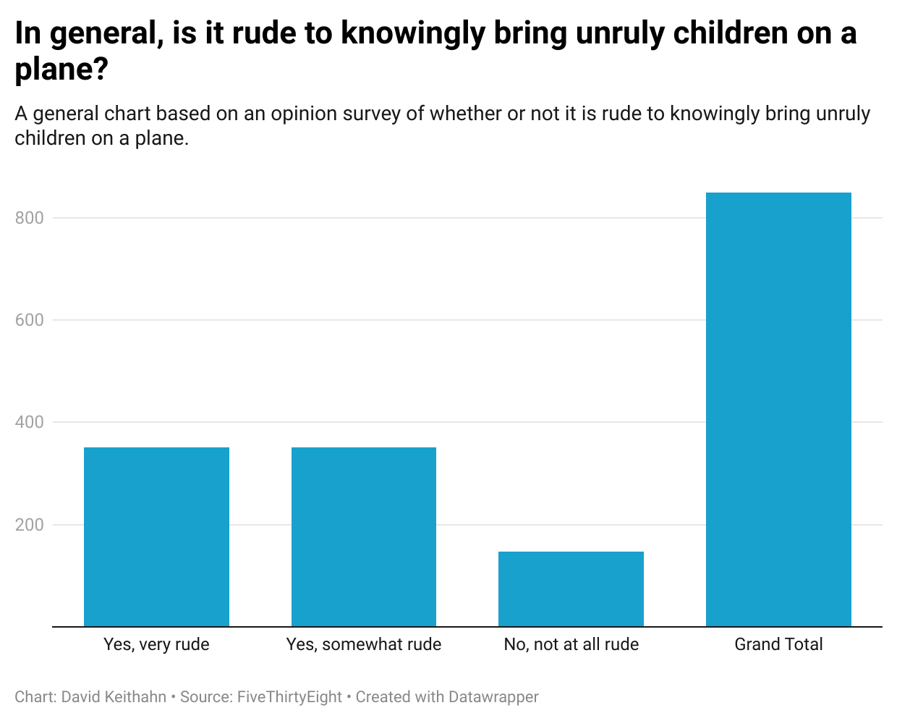

# J124Quiz
For my UC Berkeley J124 Class Quiz.

*Why I picked this Question*

I chose this question because, I have a nephew who is almost one year old and My sister (His Mother) flies often on a plane and I am worried if he begins to get fussy and act up, what people would do/think. What I found interesting is that I was right, most people think that it is generally rude to bring unruly children on a plane. Luckily my nephew is well behaved and usually sleeps the entire time on the plane so I have no thing to worry about when my sister travels with my nephew.

